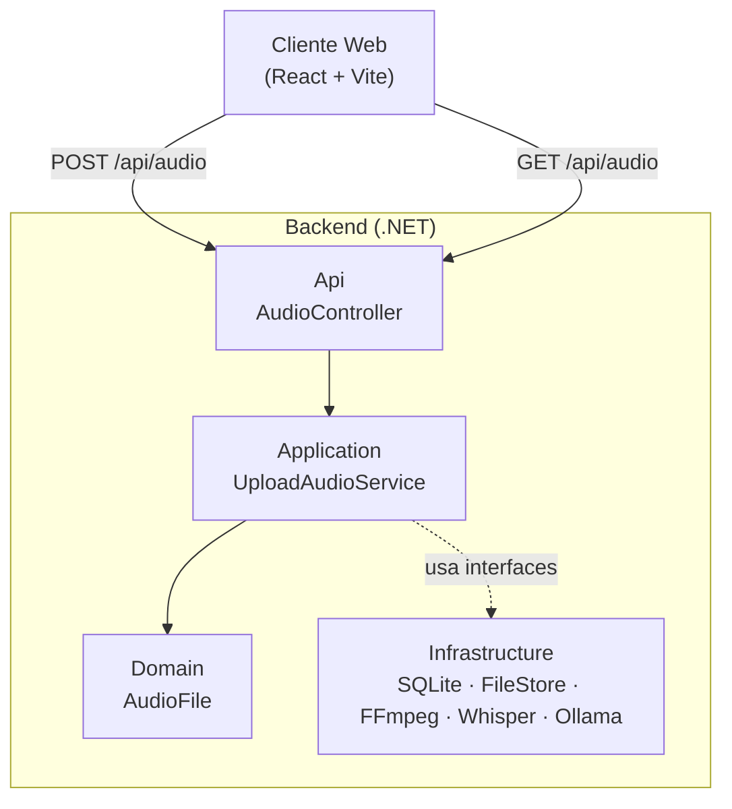
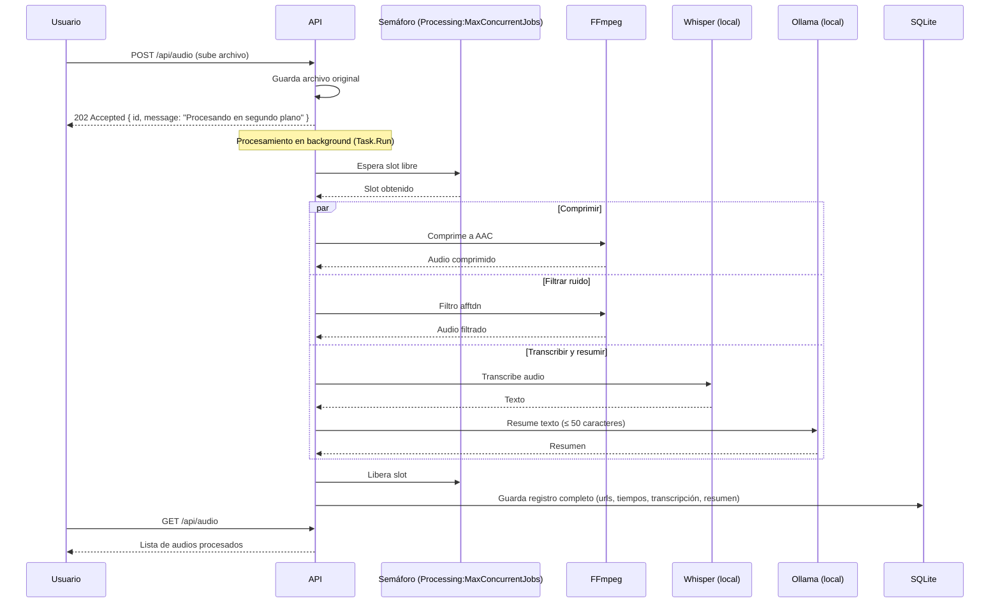

# Arquitectura y Pipeline

## Arquitectura (Clean Architecture, 4 capas)

- **Api:** recibe el request HTTP (`POST /api/audio` para subir, `GET /api/audio` para listar los audios ya procesados).
- **Application:** orquesta el caso de uso (subir, comprimir, filtrar ruido, transcribir, resumir).
- **Domain:** entidad `AudioFile`, sin dependencias externas.
- **Infrastructure:** implementaciones concretas (SQLite, disco local, FFmpeg, Whisper.net, Ollama).

Regla de dependencias: `Api → Application → Domain`, e `Infrastructure` implementa interfaces definidas en `Application`.

## Pipeline de procesamiento

El procesamiento corre en segundo plano (`Task.Run`, fire-and-forget): la API
responde con `202 Accepted` apenas guarda el archivo original, y el resultado
completo se consulta después con `GET /api/audio`. Las tres ramas (compresión,
filtro de ruido y transcripción+resumen) corren en paralelo con
`Parallel.Invoke` una vez que consiguen un slot; el resumen sí depende del
texto transcrito, así que no se paraleliza con la transcripción.

Sin un límite de concurrencia, un burst de subidas simultáneas dispara tantos
jobs en paralelo como uploads lleguen, y cada uno consume CPU y RAM a la vez
(dos procesos FFmpeg + Whisper + Ollama) — esto agotó la RAM de la máquina en
una prueba de carga con k6 documentada en el laboratorio de la semana 6. Por
eso el número de jobs que corren al mismo tiempo está limitado por un
`SemaphoreSlim` compartido, configurable con `Processing:MaxConcurrentJobs`
en `appsettings.json` (por defecto `Environment.ProcessorCount`).
