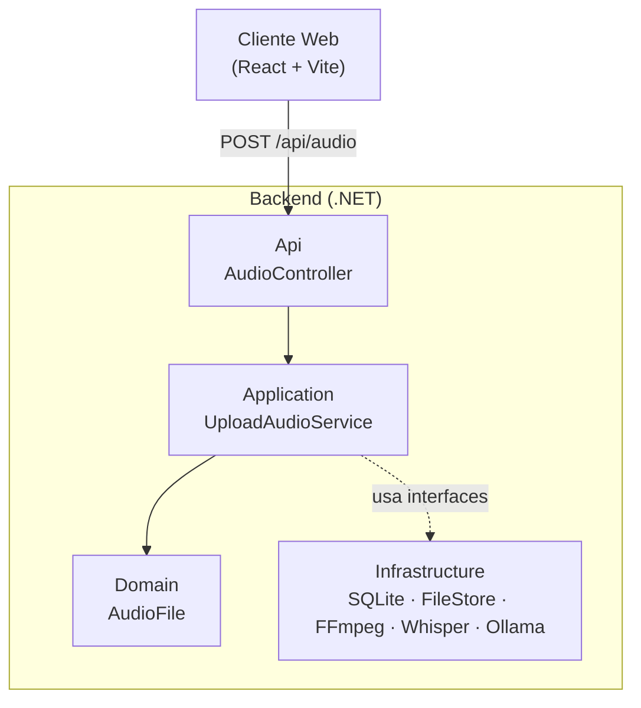
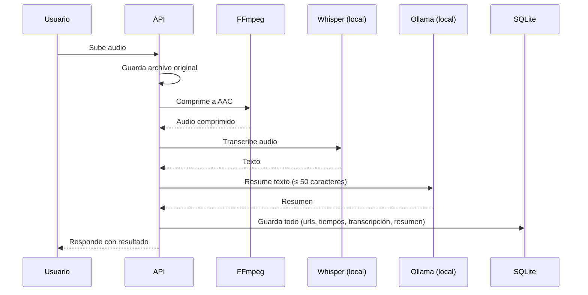

# Arquitectura y Pipeline

## Arquitectura (Clean Architecture, 4 capas)

- **Api:** recibe el request HTTP.
- **Application:** orquesta el caso de uso (subir, comprimir, transcribir, resumir).
- **Domain:** entidad `AudioFile`, sin dependencias externas.
- **Infrastructure:** implementaciones concretas (SQLite, disco local, FFmpeg, Whisper.net, Ollama).

Regla de dependencias: `Api → Application → Domain`, e `Infrastructure` implementa interfaces definidas en `Application`.

## Pipeline de procesamiento

Todo el pipeline es **secuencial** por ahora (cada paso espera al anterior). Compresión y transcripción no dependen entre sí, así que son candidatas a paralelizarse más adelante; el resumen sí depende de la transcripción, por lo que ese paso no se puede paralelizar con los anteriores.
